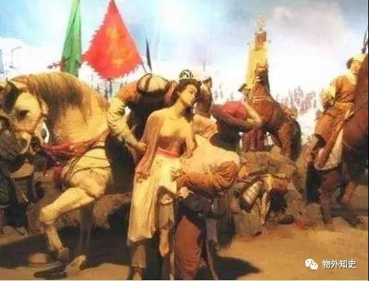

# 我的2020上半年书单（27本）

> 乱翻书的老高.
买书如山倒 读书如抽丝。 

2020过得崎岖而飞快。这半年读的比买的少，读的越来越慢，买的越来越多。给自己定的一年读50本书的目标，现在来看，似乎还算容易完成。

2020过半，把这半年读过的书记录下来，以免忘得太快。

 

《罗马人的故事》1-15卷

作者：（日）盐野七生

字数：逾200万字

评：从去年12月份开始读《罗马人的故事》，让我对罗马发展史有了细腻深入的了解。过去对罗马的认知，更多是眶嵌在欧洲史和中东史中笼统获取的。

我在开罗、安曼、伊斯坦布尔、以弗所、巴塞罗那，都看到过罗马的痕迹，却直到读完这套书，才真正理解了“欧洲只有三座城市：罗马、耶路撒冷、君士坦丁堡”这句话的含义。

十五卷本，多达超过200万字的体量，日本作家盐野七生花了15年写就的这套书，全部读完要莫大的勇气。从共和体制到帝国彪炳，盐野七生事无巨细地罗列了几乎每个朝代的发展状况，甚至给人一种过于繁琐的读感。

但说来奇怪，占用了很大篇幅的苏拉、汉尼拔、凯撒、屋大维、五贤帝、尼禄等人的故事，固然令人拍案叫绝，但帝国后半段的“叛教者尤利安”却给我留下了最为深刻的印象。这个罗马史上最后一个多神教者，一生命途多舛，悲情的复仇王子形象，跃然纸上。不管命运如何跌宕起伏，总归都是人生吧。

花了5个多月才看完这套书，值得推荐。以后去罗马，面对着那些穿越几千年风雨的石刻建筑，至少不会瞠目结舌，不知如何鉴赏吧。

 

 

《邻居与敌人——阿拉伯人和犹太人在巴勒斯坦和以色列 1917-2017》

作者：（英）伊恩.布莱克

字数：53万字

评：这本书对我而言，可以进一步用丰富的史料来补充对巴以冲突的认知。英国政府发布《贝尔福宣言》之后百年间，中东地区竟无宁日。

以目前的现状来看，巴以冲突也没有解决的可能性。英国人充分发挥了搅屎棍的作用，搞乱中东地区后全身而退；神经大条的美国人兴冲冲跑来插手，却根本不是为了巴勒斯坦地区人民的福祉。

以色列得国不正，巴勒斯坦委曲求全，这对世纪冤家，估计还要再混战百年。

读这本书，对中东历史需要一点基础性的背景了解，否则读起来可能有点费劲。

 

《第一次十字军东征》

作者：（英）彼得福兰科藩

字数：22万字

图片

评：这本书很有意思，从号召欧洲人东征的乌尔班二世和东罗马帝国皇帝阿莱克修斯一世两个人的角度，来看待那段历史。把第一次十字军东征的背景、进展、结果，用大量史料和故事描绘出来，读起来比较轻松，一周即读完。

 

《阿拉伯人眼中的十字军东征》

作者：（法）阿敏马卢夫

字数：26万字

图片

评：读完上一本《第一次十字军东征》，紧接着就读这本，相互参照，更易理解。在阿拉伯人眼里，他们无法理解欧洲人为什么要突然千里迢迢跑来中东地区，为了一个幻想中的信念，不惜大肆杀戮。

在三百年的历程中，阿拉伯人其实和欧洲人并无二致，也有胆怯懦弱，也有振臂一呼，也有两面三刀，也有瓜田李下。从君士坦丁堡一路南下，沿着地中海东岸，欧洲人和阿拉伯人混战两百多年，给后世留下了无尽的传说和故事。

理解现在的欧洲和中东，十字军东征史是无法绕过的一段。

对中东感兴趣的人来说，这两本书，值得一读。

 

《沙特公司——沙特阿拉伯的崛起与沙特阿美石油的上市之路》

作者：（美）埃伦R沃尔德

字数：23万字

图片

评：江山代有才人出，各领风骚数十年。几十年前，中东逊尼派的扛把子还是埃及人，现在已经换成了沙特人。这个建国不过百年的石油富国是如何诞生的，他们和美国人之间剪不断理还乱的石油情缘是如何演绎的，这本书用足够多的细节，给出了答案。

了解的多了，才不至于被江湖传说给蒙骗。作为麦加、麦地那的拥有国，我对沙特还是颇有兴趣的。据说沙特快要开放个人旅游签了，是时候去这片沃土看一看了。

 

《最早的中国》

作者：许宏

字数：30万字

图片

 

评：这本书其实是二里头文化遗址剖析的衍生品。中国的国家脉络向上溯源，可以在二里头找到答案。许宏教授深耕二里头文化多年，这本书也算是对他二里头考古数十年的一个总结吧。

对夏商周早期文明有兴趣的，可以找来看一看。以后找时间去二里头遗址看看，和书上的内容对证一下，应该会有些意思。

 

《统一与分裂——中国历史的启示》

作者：葛剑雄

字数：30万字

图片

评：葛剑雄老先生的名作，也有争议。中华文明的疆域载体，总归需要有一个历史的研判。中国什么时候形成，历史上的疆域和当下有什么异同，葛老先生提出了自己独特的观点。

不要上纲上线，有不同意见也没关系，翻一番，增长见识，看看权威是如何研判的，也是一件有趣的事情。

 

《曼哈顿传奇——世界中心的岛》

作者：（美）肖拉瑟

字数：36万字

图片

评：这本书并没有涉及现代曼哈顿岛的经济发达史，作者讲的是从殖民地时代早期开始，曼哈顿岛是怎么从印第安人的栖息地，一步步变成了欧洲人的地盘。

有别于我们对美国建国史常规的观察角度，这本书没怎么涉及马萨诸塞新英格兰地区的史料，更多是基于纽约地区的发展史，来观察欧洲人的美国化。角度很独特，史料很珍贵，可以泛泛一读。

 

《幽微的人性》

作者：李玫瑾

字数：26万字

 

图片

评：作为一名犯罪心理学家，李玫瑾在大众视野里，却是以育儿专家的身份走红，啼笑皆非。这本书是李玫瑾在电视节目中的访谈录，口语化较多，浅显易读，且有不少有意思的心理分析观点。尤其是对马加爵一案的分析中，我第一次知道了通过心理分析得来的关键案情，有些意外。

不同于其他的心理学读本，这本书的案例呈现很多，也夹有不少理论分析，可读性很高。

 

《追捕祝融星》

作者：（美）托马斯利文森

字数：14万字

图片

评：这是一本科普读物，介绍的是上个世纪初，人们观察到水星运行轨迹的奇异之处，推测出水星轨道中或许存在着一颗名为“祝融星”的行星。直至爱因斯坦利用相对论解释了这一天文现象，才终结了祝融星的传说。

有趣的天文史故事，但里面一些涉及到高等物理学的专业内容，只能囫囵吞枣了。大人们读完可以给小朋友讲一讲，也可以捎带温习一下自己学过的天文学和天体力学。

 

《激进之踵——戊戌变法反思录》

作者：羽戈

字数：11万字

 

图片

评：又是一个戊戌年。我们站在上帝视角，评价1898年的中国，固然能得出各个历史人物和事件的利弊得失。但身处那个跌宕的年代，光绪、谭嗣同、康有为、梁启超，这些人的选择和判断，到底是激进偏执的，还是戒急用忍的，没人能告诉他们答案。

晚清亡于激进，但他们为什么会选择激进，回看戊戌，对当下的观察也有裨益。

书不厚，很快就可以读完，作者言语温和不乖张不偏执，是本好书。

 

《孔子大历史——初民、贵族与寡头们的早期华夏》

作者：李硕

字数：21万字

 

图片

评：写孔子的书很多，但这本书更有趣。作者出身北大历史学系，第一手材料应用得当，而且有很多地方加入了自己的合理化想象。增长了不少见识，理顺了一些模糊的判断。

文字很有趣，行文很流畅。记得很多年前读王小波的杂文，有过一段对孔子的评述，颇有相似之处。看完这本书，我又找来山东电视台在90年代拍摄的电视剧《孔子》，拍的严丝合缝，不戏说不呆板。书和剧都好看。

 

《日本人为何选择了战争》

作者：（日）加藤阳子

字数：23万字

 

图片

评：这个世界上没有无缘无故的爱，也没有无缘无故的恨。日本人在一百多年间，先后挑起多起战事，甲午战争、日俄战争、九一八事变、卢沟桥事变、太平洋战争。他们为什么会选择战争，这些战事到底有什么背景，日本国内的影响如何，日本民众如何看待。

加藤阳子是一个和安倍政权屡屡唱反调的学者，这本书是他面向学生的课堂讲义合集。书中呈现了大量日本战前的社会面貌和政治格局，从日本人自身角度来看待日本半年扩张史。角度新颖，和我们自小接受的教育观点颇有不同，很值得一读。

 

《言论的边界——美国宪法第一修正案简史》

作者：（美）安东尼刘易斯

字数：13万字

 

图片

评：自由派人士最喜欢谈及的就是美国宪法第一修正案。条文很简单：禁止美国国会制订任何法律以确立国教；妨碍宗教信仰自由；剥夺言论自由；侵犯新闻自由与集会自由；干扰或禁止向政府请愿的权利。该修正案于1791年12月15日获得通过，是美国权利法案中的一部份。但修正案的诞生，才是故事的开始。

很多人都羡慕美国人的言论自由，羡慕他们可以烧国旗，可以骂总统。但一直到19世纪，故事可完全不是这样。报纸要是敢说总统的坏话，作者蹲监狱是家常便饭。修正案是如何一点一点被美国上上下下接受的，言论自由给人民带来什么样的福祉和危机，这本书细致地描述了历史的演进。

权利都是靠争取得来的，不是靠当局者施舍的。太多人喜欢吹美国的种种自由先进，却不敢不知去争取，去表达。此前某一位朋友大谈特谈对自由的向往，痛骂当下政体，却又热衷于竞争党委书记的位子。在我看来，哪怕你去竞选业委会主任，在小区里体现微型而真实的民主，也是你为社会改良做出的真实贡献。这远比你冷嘲热讽唧唧歪歪来的实在，令人信服。

多看看真实的历史，少被网帖二道贩子油蒙了心。